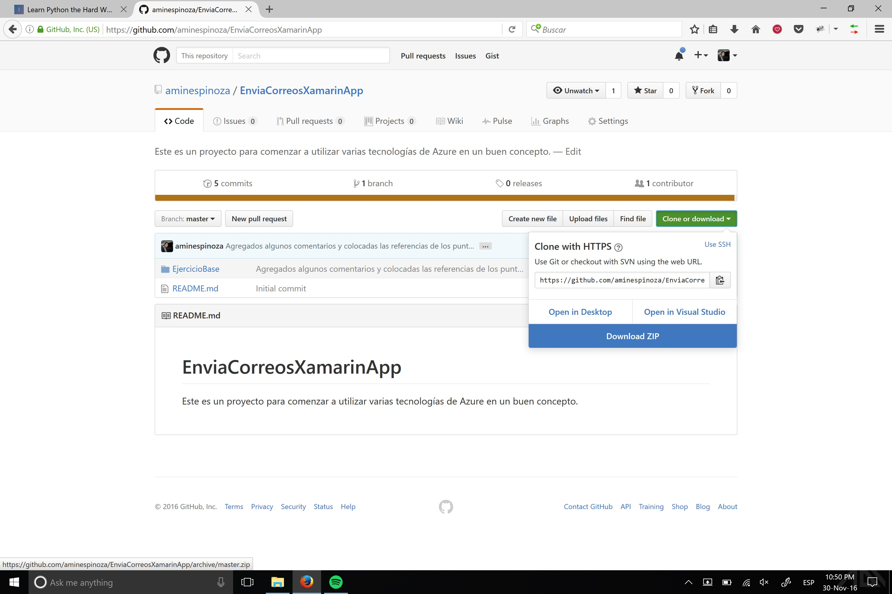
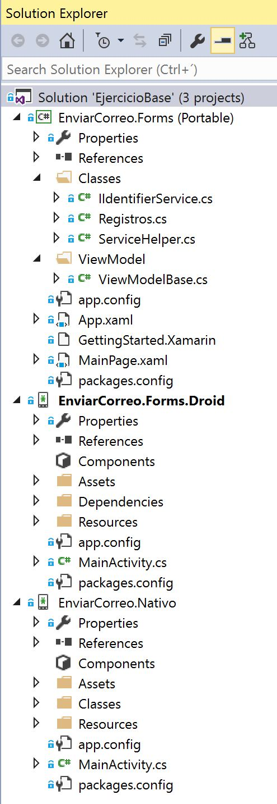

# Ejercicio Base

Para comenzar a utilizar este proyecto, debes ir un nivel arriba y seleccionar la opción de Descargar ZIP para obtenerlo.



Una vez descargado y abierto, deberás abrirlo en Visual Studio y el resultado debe ser como el siguiente en tu explorador de soluciones.



Ya abiertos todos los proyectos, selecciona una de las dos opciones por desplegar, puede ser utilizando **Xamarin Nativo** o **Xamarin Forms**. Si deseas hacerlo con la versión nativa solo selecciona **EnviarCorreo.Nativo** como proyecto de inicio.


Puedes hacer exactamente lo mismo con el proyecto **EnviarCorreo.Forms.Droid** si quieres hacerlo vía Forms. 

# Modificar el proyecto de Xamarin Nativo

Para modificar el proyecto de Xamarin Nativo lo que debes hacer es abrir el archivo MainActivity.cs en el manejador del evento clic del botón, ahí podrás agregar tu correo y el identificador del evento que quieras.
```csharp
private void btnReportar_Click(object sender, EventArgs e)
{
    ServiceHelper.InsertarEntidad("micorreo@servicio.com", "4389");
    button.Text = "Reporte enviado";
}
```
Pon tus datos, ejecuta la aplicación y después de presionar el botón podrás recibir un correo con la confirmación de que ya todo está listo.

# Modificar el proyecto de Xamarin Forms
Para modificar el proyecto de Xamarin Forms lo que debes hacer es abrir el archivo ViewModelBase.cs y ahí modificar el comando para agregar tu correo y el identificador del evento que quieras.
```csharp
IdentificadorCommand = new Command(() =>
{
    //aquí es donde debes poner tu dirreción de correo
    string direccionCorreo = "micorreoforms@servicio.com";
    string evento = "4389";
    var cadenaIdentificador = DependencyService.Get<IIdentifierService>().ObtenerIdentificador(direccionCorreo);

    ServiceHelper servicioApp = new ServiceHelper();
    servicioApp.InsertarEntidad(cadenaIdentificador, direccionCorreo, evento);
    BtnText = "Reporte enviado";
});
```

Pon tus datos, ejecuta la aplicación y después de presionar el botón podrás recibir un correo con la confirmación de que ya todo está listo.

Como verás los pasos son quizá un poco diferentes pero el objetivo es el mismo en ambos casos. Ahora, lo recomendable es que revises los proyectos, conozcas su estgructura y veas todo lo que hay en ambos escenarios.
