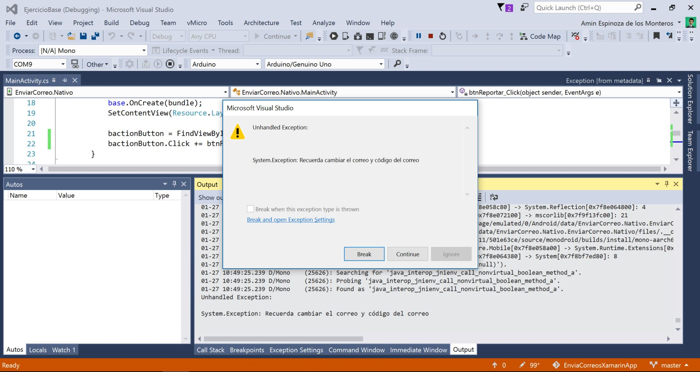

# EnviaCorreosXamarinApp
Este proyecto es el primer ejercicio pensado para considerar que tienes ya todo instalado para un ambiente de desarrollo con Xamarin.

En la carpeta de [EjercicioBase](https://github.com/aminespinoza/EnviaCorreosXamarinApp/tree/master/EjercicioBase) podrás encontrar una solución en Xamarin Nativo (también existe Xamarin Forms).

Como lo dice la primera parte, si lograr ejecutar los siguentes pasos sin problemas en tu equipo significará entonces que ya tienes todo listo y ya estás registrado para participar en varias iniciativas y además comenzar a desarrollar aplicaciones multiplataforma.

# Ejercicio Base

Para comenzar a utilizar este proyecto, debes seleccionar la opción de Descargar ZIP para obtenerlo.


Una vez descargado y abierto, deberás abrirlo en Visual Studio y el resultado debe ser como el siguiente en tu explorador de soluciones.


Ya abierto tu proyecto, selecciona **Xamarin Nativo** como proyecto de inicio (ya está por defecto señalado como proyecto de inicio).


# Modificar el proyecto de Xamarin Nativo

Para modificar el proyecto de Xamarin Nativo lo que debes hacer es abrir el archivo MainActivity.cs en el manejador del evento clic del botón, ahí podrás agregar tu correo y el identificador del evento que quieras desde las variables globales establecidas al principio de la clase.

```csharp
string emailBase = "amin.espinoza@gmail.com";
string codeBase = "iniciativa";
```
Como podrás ver, estas variables se utilizan en el método **btnReportar_Click** y el que las hayas cambiado hará que todo funcione a la perfección.

```csharp
private async void btnReportar_Click(object sender, EventArgs e)
{
	ServiceHelper serviceHelper = new ServiceHelper();
	if (emailBase == "amin.espinoza@gmail.com" || codeBase == "iniciativa")
	{
		throw new Exception("Recuerda modificar el código fuente para ingresar tu e-mail y ID de evento");

	}
	actionButton.Enabled = false;
	await serviceHelper.InsertarEntidad(emailBase, codeBase);
	actionButton.Text = "Reporte enviado";

	Toast.MakeText(this, "Tienes correo nuevo!", ToastLength.Short).Show();
}
```
También podrás encontrar que si ejecutas tu proyecto sin modificar, obtendrás la siguiente excepción.



Si te aparece, recuerda solo modificar tus variables globales para no tener problemas. Al final podrás ver en tu emulador o dispositivo el siguiente resultado después de haber presionado el botón.


